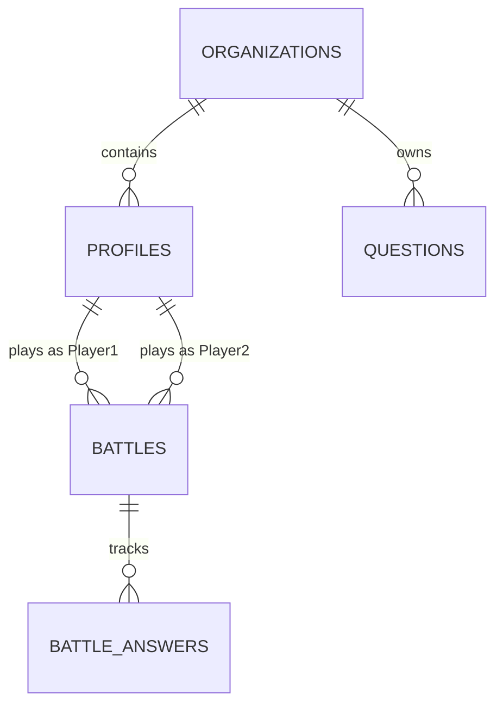

# Entity Relationships (ERD)

## 1. Purpose
Provides a clear, mapped understanding of how core data models interact. It is the visual map of the database schema.

## 2. Why It Matters
Without an ERD, developers might accidentally create orphaned records or circular dependencies. Understanding relationships is critical for writing efficient SQL `JOIN`s and cascading deletes.

## 3. Example Structure
- **Core Entities**: The central pillars of the DB.
- **ERD Diagram**: A Mermaid.js visual representation.
- **Relationship Rules**: Cascade behaviors (e.g., "Deleting a University deletes all its Departments").

## 4. Example Content
**Core Entities**: `organizations`, `profiles`, `questions`, `battles`.

**ERD Diagram**:

**Relationship Rules**:
- *Profiles to Organizations*: Many-to-One. Deleting an Organization `CASCADES` to delete all associated profiles.
- *Battles to Profiles*: Many-to-One. Deleting a profile does NOT delete the battle history; instead, `ON DELETE SET NULL` for the player ID to preserve the historical record, but removes the PII.

## 5. AI Usage Instructions
> [!IMPORTANT]  
> Before an AI generates a SQL query with `JOIN`s or nested Supabase `select()` calls, it must reference this ERD to ensure it understands the cardinality (1:1, 1:N, N:M) of the entities. 

## 6. Developer Usage Instructions
- When adding a new table, update the Mermaid diagram in this file.
- Be extremely cautious with `ON DELETE CASCADE`. Always ask: "Do we want to lose this historical data?"

## 7. Best Practices
- **Do**: Use standard crow's foot notation in ERDs.
- **Don't**: Create Massive N:M mapping tables without a clear business reason.

## 8. Maintenance Strategy
- **Owner**: Database Administrator.
- **Update Frequency**: Every time a schema migration is merged.
- **Trigger**: `CREATE TABLE` or `ALTER TABLE` commands modifying Foreign Keys.
